# CACHE - Digital Skills Project
**CACHE** is a simple website that will allow users to track and manage their finances. To manage their finances, they will link their bank account with the application. They can then access their transactions, create savings goals, and calculate their expected pay. The solution will use third party APIs such as Plaid, for bank account linking, and ChatGPT for chatbot functionality. The main goal is to help shopping addiction.

## Table of Contents

- [Overview](#overview)
- [Installation](#installation)
- [Usage](#usage)

## Overview
This website will be a full stack application. The frontend will be created using React JS (JavaScript web framework). The backend will use Python 3.9.18 and will use the Flask libary to handle web requests. The third party APIs will be ChatGPT, for chatbot functionality, and Plaid, for banking functionality. These APIs will communicate with the Python app. Both the frontend and backend will be hosted on AWS amplify and the database will be hosted on AWS RDS.

Some tools that you will need are:
- Miniconda to manage Python libraries and environments.
- Docker to containerise the Python app so that it will run the same on different machines.
- MySQL Workbench to be able to create a database that will work with the Python App.
- Postman to test all the Python App endpoints during development.
- Node so that you can run the frontend locally.

## Installation
### GitHub CLI
__Note:__ make sure you install Git before installing the GitHub CLI tool. You can do this at the url https://git-scm.com/downloads.

I would use the GitHub CLI tool to be able to pull the repository. go to the url https://cli.github.com 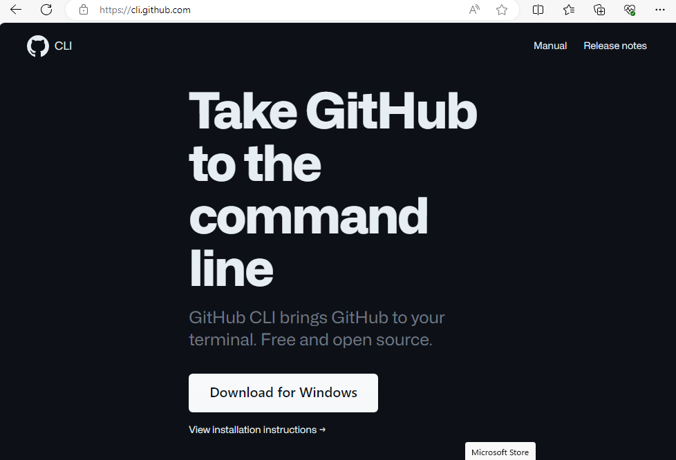
This will allow for you to authenticate your credentials with your local git installation. To download the repository using the github cli run this command.
Then in powershell run the command:

```git
gh auth login
```

This should show allow you to use git with your github login.
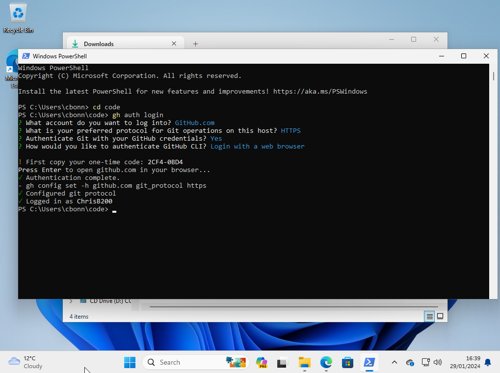
Now in the directory of your choice run this command:

```git
git clone https://github.com/ChrisB200/cache.git -b development
```

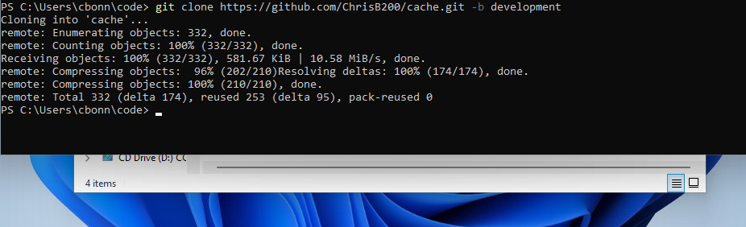
This will download the repository from github so that you can start to make changes.


### Miniconda
To install Miniconda you need to go to the url https://docs.conda.io/projects/miniconda/en/latest/index.html 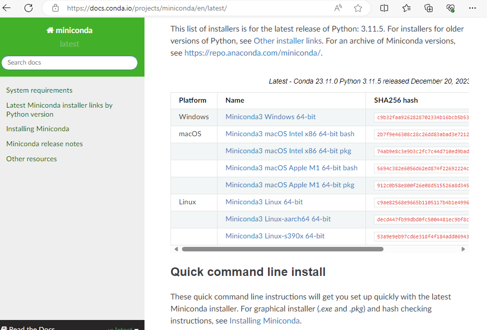
Press the __Miniconda3 Windows 64-bit__ link to download the application.
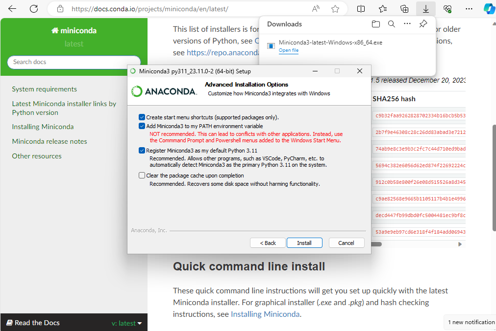
When downloading ensure that you have the checkbox __Add Miniconda3 to my PATH environment variable__ This will ensure you can run the commands in cmd and powershell.
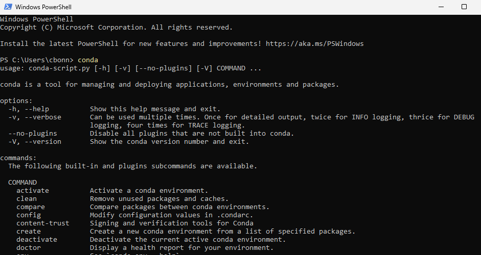
To test if __miniconda__ is installed correctly you can type __conda__ into either command prompt or powershell and it should return the tools.

Now in the Cache folder location cd into the src folder, this is where the Python Code is contained. Yeah i know its buried deep into the project but blame AWS lol. Here is the command:
```powershell
cd cache\amplify\backend\api\cachebackend\src
```
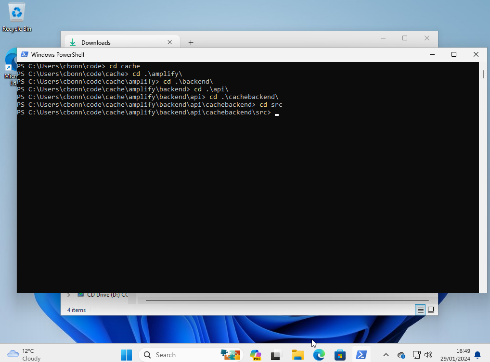

Now you have to create a virtual environment. This means that you have an isolated python environment with the exact same python version and external libraries as me. This is done by using the environment.yml file in the src folder. The command that you will need to run is this:
```powershell
conda env create -f environment.yml
```
ensure that you run this command in the src directory.

Now open Visual Studio Code and open the project's location's folder. Then install the Python Extension and open a random python file (it can be any file).

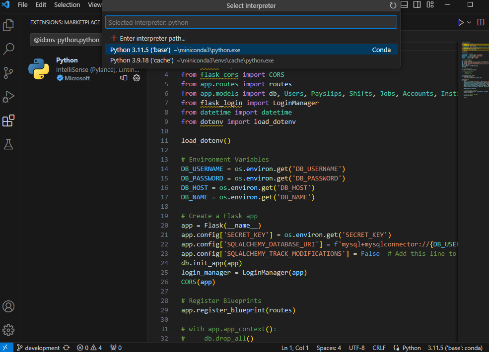
Then press the python version in the bottom right, in my case it is 3.11.5. Then after this their should be a dropdown at the top of the screen. Press the python version which has __cache__ in brackets. This now means that the python version and python libraries will be only used for this project. Now you can program as usual.

### Postman
Visit the url https://www.postman.com/downloads/ and install postman. This will allow for you to run code at specific api endpoints.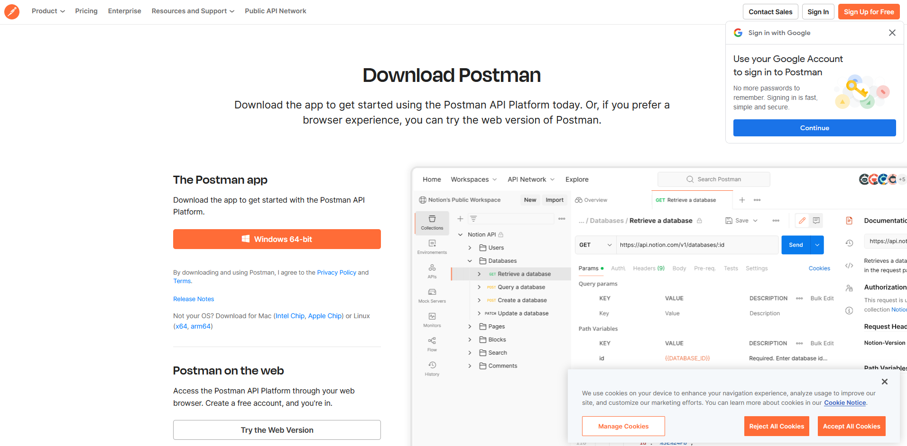
After you have downloaded this message me and i can invite you to the workspace which will allow for us to collaborate.

When you have joined the email it should show this screen 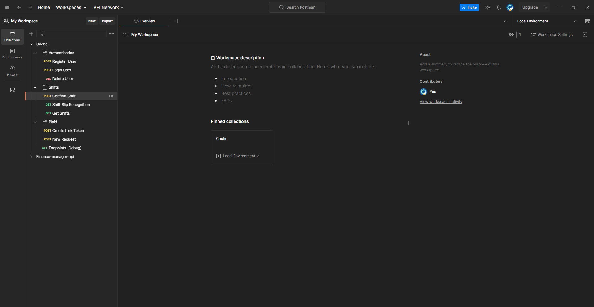.

On the left is all tge testing points. So for every function you have written you add it into postman (if it is not already added) and then you can test it.

Here is an example.
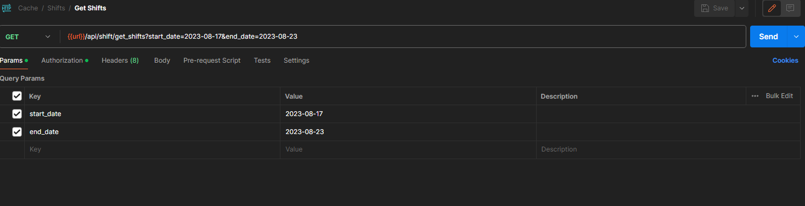
This is how i tested the get shifts function. in the params section i added the start_date and end_date and gave it dates. This basically acts as if we were on the completed website. parans are everything after the ?

However there is an issue. you need to be logged into the application to run this path. To log into cache via postman you have to get a token. There is currently a test account in the login User area. 
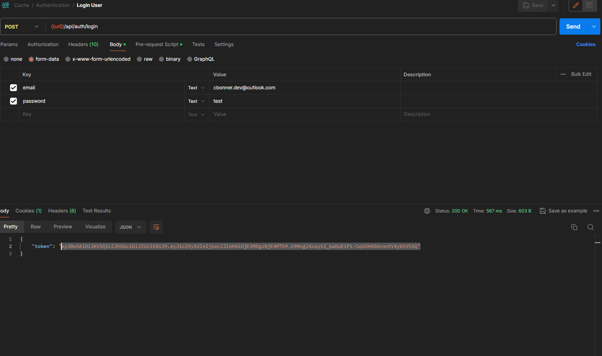
So to log in just enter these details into the BODY section (it should already be there). once you have done that at the bottom there should be a token that has showed up. Copy this.
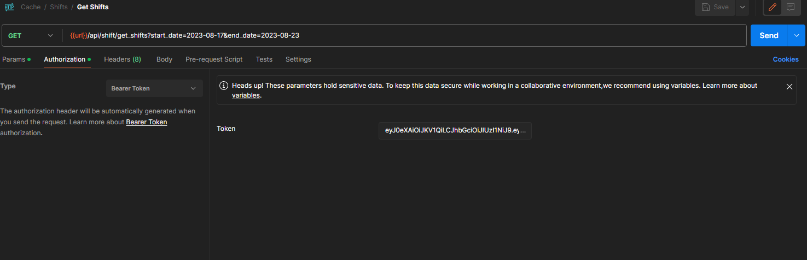
Now for any endpoints that need a login you have to go to the authorization tab. select type to Bearer Token. And then paste the token in. Now you are using the test account to run features.


When creating new endpoints you have to choose the type of request. These types are GET, DELETE, POST, etc.
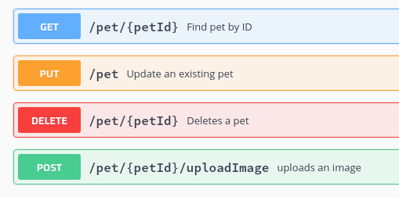

There are also error codes that will be shown. You may have heard 401 error and stuff like that.
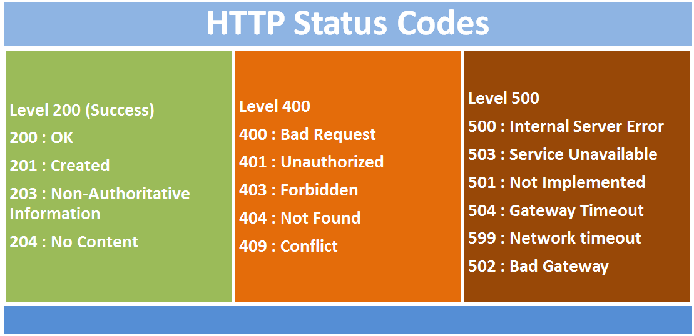

### Node
Node lets you run the frontend. This is not needed but it will help when writing the backend. visit this url https://nodejs.org/dist/v20.11.0/node-v20.11.0-x64.msi This will download the correct version.

## Usage
### Pulling the Project
There are 2 branches. There is the main branch which is used by AWS Amplify to update the changes in the cloud. NEVER EDIT THIS BRANCH UNTIL THE APP IS COMPLETE. This is because it will push the changes in the cloud, and if the app is not tested corrcetly it can cause downtime. The development branch is the branch that you should edit and is the branch that will run locally on your machine. To pull this branch you use this command.

```git
git clone https://github.com/ChrisB200/cache.git -b development
```

### Python
#### Project Structure
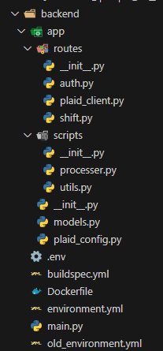

Here is the structure of the backend. The main.py file is there to run the program. The environment.yml file stores all the external libraries so that it is easy to download. The dockerfile tells docker how to build the application. The buildspec.yml file is something to do with amplify, just don't change it. The .env file stores all the environment variables, this is only for development. 

Then there is an app folder. This app folder contains 2 other folders and some additional files. The routes folder categorises endpoints by their function. For instance, the auth.py file will be the code for all endpoints relating to authentication. The scripts folder stores all the external python files that I have created. for instance utils.py stores all functions that are used a lot. 

You might see in each folder there is a __init__.py file. This file turns the whole folder into like a python module. there is one in app which will combine everything and there is one in routes and scripts. This just makes it easier to run it. The models.py file stores all the database tables. The plaid_config.py sets up plaid for external use.
#### Flask
To run the project you need to run it via the main.py file. This should start the development server.

Flask works by using a lot of functions. So if you want to create a new endpoint then you have to create a function. I will show you a live example of this.

In the auth.py file in the routes folder i have created a new endpoint. 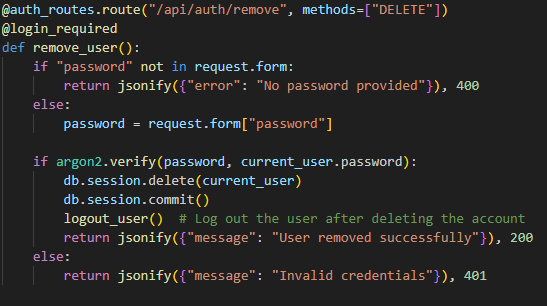

The first line creates the route. This means that when you run the app and visit the url http://localhost:8000/api/auth/remove it will run this function. The methods part is specifying the type of request that it is. here it is a delete request because we want to remove the user. The @login_required means that to connect to this route you must be logged in.

Then we check if the request has a password. if it does we store the password. we then use the argon2 library (encryption library) to see if the password given is the same as the current_user's password. if it is then you have to delete the current user from the database, commit these changes so that the database gets updated, logout the user and return a message with a 200 status code (meaning it was successful). That is how you create new routes.

to create your own route you must do (routename).route(endpoint, methods). 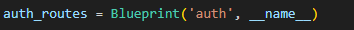 

At the beginning of the file i had created a auth_routes blueprint. This is the same in all files where it has a blueprint at the beginning. This means that you __MUST__ use that at the beginning. so here i have done
```python
@auth_routes.route("/api/auth/remove", methods=["DELETE"])
```
If this was in the shift file then it would be
```python
@shift_routes.route("/api/shift/remove", methods=["DELETE"])
```
#### Plaid
So how plaid works is very weird so bear with me.for more information visit this site https://plaid.com/docs/link/.

So plaid lets you link this app we are building to a customers bank account. This process is called linking. We then store a link token for each banking institution. a banking institution is just a banking company, as an example Barclays is one. This gives us access to all the accounts that a user has with the institution. So if i signed up right now it would tell me to link my bank account. If this is successful then this program will have access to all my accounts that i have with barclays which would be my current account and my savings account. 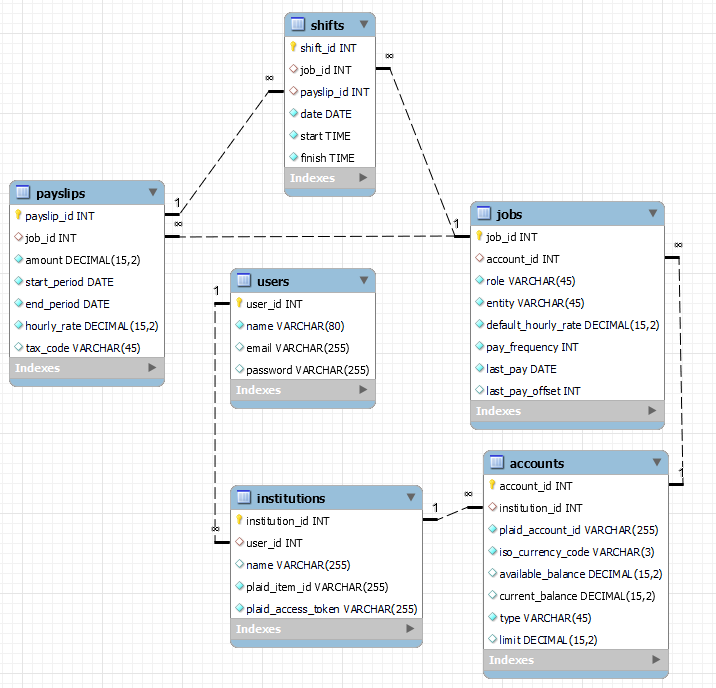
So here we have all the tables so far.

This is how the relationships work:
- A user can have many institutions (so they can be banking with both barclays and santander).
- An institution can have many accounts (this is like if you had a barclays savings account and a barclays current account).
- an account can have many jobs (So if you get paid you have to link what job has entered the money).
- A job can have many shifts (These are like work shifts).
- A job can have many payslips (This is a compilation of all your shifts. so if you got paid monthly it would show all your shifts for the month).
- A job can have many shifts.

We now need more tables for our savings pockets features, transactions tracking, budgeting etc.
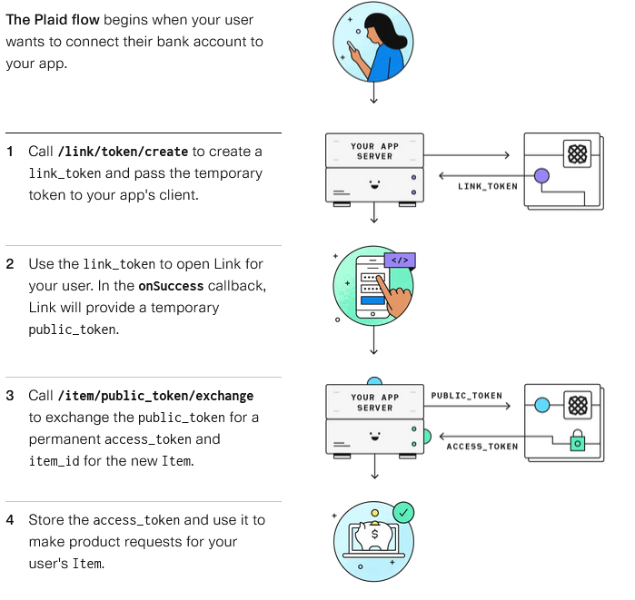

This is a visual diagram on how our app will work with plaid. after you have linked your institutions and accounts, these are known as items, you can then start automatically getting data from these accounts.

### Tasks

#### Task 1 (COMPLETE)
I want you to get all the shifts between 2 dates. So i would start in the shift.py file and where it says this:
```python
# Route to return the most recent shifts for a user in the database 
@shift_routes.route("/api/shift/get_shifts", methods=["GET"])
@login_required
def get_shifts():
    start_date = request.args.get("start_date")
    end_date = request.args.get("end_date")
```
I want you to finish it off. So what you would do is get all the shifts related to the user that is between a given start date and end date. If you get stuck ask chatgpt and dont forget you can ask me at any time. I have given you so much to understand in such a short time frame so let me know what you are confused about even if you think its a stupid question.


#### Task 2
I want you to get all the bank accounts that a user has available to them. I would start in the accounts.py file where it says this:
```python
@account_routes.route("/api/accounts/get_accounts", methods=["GET"])
def get_accounts():
    pass
```
Get all the accounts that a user has selected and return them as JSON data. Just like the get_shifts you will need to use the return_json function. However this is not written for accounts so you will need to go into the models.py file and add a return_json function to the accounts class. __ASSUME THAT THE USER IS ALREADY LOGGED. TO GET THE CURRENT USER USE THE current_user VARIABLE.__
